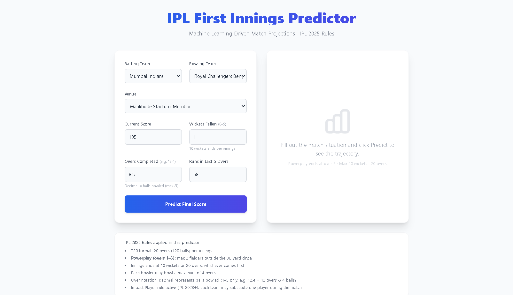
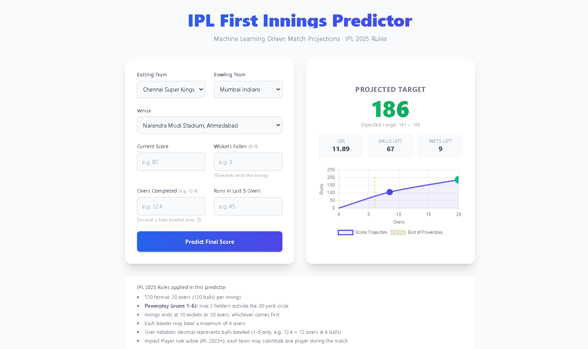

# 🏏 IPL Score Predictor


> A machine learning web application that predicts the final score of an IPL T20 innings in real-time, using a trained **Random Forest Regressor** with IPL-specific feature engineering — achieving a **~95% R² score** on held-out test data.

---

## 📸 Screenshots

| Form Panel | Result Panel |
|---|---|
|  |  |

---

## 🎯 Overview

The **IPL Score Predictor** takes a live mid-innings snapshot and outputs the expected final total for the batting team. It factors in:

- **Current run rate (CRR)** and momentum (runs in last 5 overs)
- **Wickets in hand** and balls remaining
- **IPL phase awareness** — Powerplay (overs 1–6), Middle overs, and Death overs (overs 17–20)
- **Venue and team matchups** via one-hot encoding

The entire pipeline goes from raw ball-by-ball data → cleaned features → trained model → Flask web UI.

---

## 🛠️ Tech Stack

| Layer | Technology |
|---|---|
| Language | Python 3.10+ |
| Web Framework | Flask 2.x |
| ML Model | Scikit-Learn `RandomForestRegressor` |
| Data Processing | Pandas, NumPy |
| Frontend | HTML5, Tailwind CSS (CDN), Chart.js |
| Serialization | Pickle |
| Containerization | Docker |

---

## 📁 Directory Structure

```
ipl-score-predictor/
│
├── app.py                  # Flask application — form parsing, feature engineering, prediction
├── data_cleaning.py        # Raw CSV → cleaned_ipl_data.csv (run first)
├── model.py                # Trains RandomForest on cleaned data → model.pkl (run second)
│
├── templates/
│   └── index.html          # Jinja2 template — form + results + Chart.js trajectory
│
├── screenshots/            # App screenshots 
│   ├── form.png
│   └── result.png
│
├── ball_by_ball_ipl.csv    # ⚠️  Raw dataset — NOT committed to Git (see .gitignore)
├── cleaned_ipl_data.csv    # ⚠️  Intermediate dataset — NOT committed to Git
├── model.pkl               # ⚠️  Serialized model — NOT committed to Git
│
├── requirements.txt        # Python dependencies
├── Dockerfile              # Container definition for cloud deployment
├── .gitignore
└── README.md
```

---

## ⚙️ Local Setup & Installation

### Prerequisites

- Python 3.10+
- pip
- Your raw `ball_by_ball_ipl.csv` dataset (Kaggle IPL ball-by-ball dataset)

### Step 1 — Clone the repo

```bash
git clone https://github.com/aakanksha34k/ipl-score-predictor.git
cd ipl-score-predictor
```

### Step 2 — Create a virtual environment

```bash
python -m venv venv

# Activate on macOS/Linux:
source venv/bin/activate

# Activate on Windows:
venv\Scripts\activate
```

### Step 3 — Install dependencies

```bash
pip install -r requirements.txt
```

### Step 4 — Add your raw dataset

Place `ball_by_ball_ipl.csv` in the project root. This file is **not** included in the repo (see `.gitignore`).

### Step 5 — Generate the cleaned dataset

```bash
python data_cleaning.py
```

This outputs `cleaned_ipl_data.csv` (~148,000 rows).

### Step 6 — Train the model

```bash
python model.py
```

This trains the `RandomForestRegressor`, prints evaluation metrics, and saves `model.pkl`.

**Expected output:**

```
R² Score : ~0.9500  (1.0 = perfect)
MAE      : ~4–6 runs
model.pkl saved successfully!
```

### Step 7 — Run the Flask server

```bash
python app.py
```

Open your browser at **[http://127.0.0.1:5000](http://127.0.0.1:5000)**

---

## 🐳 Docker Deployment

> **Note:** Generate `model.pkl` locally first (`python model.py`), then build the image.

```bash
# Build the image
docker build -t ipl-score-predictor .

# Run the container
docker run -p 5000:5000 ipl-score-predictor
```

Open **[http://localhost:5000](http://localhost:5000)** in your browser.

---

## 🧠 How the ML Model Works

### 1. Data Cleaning (`data_cleaning.py`)

Raw ball-by-ball data is transformed into a prediction-ready dataset:
- Filters for current IPL franchises only (10 active teams)
- Computes cumulative `current_score`, `wickets_fallen`, and `balls_left` per ball
- Calculates **CRR** = `(current_score × 6) / balls_bowled`
- Computes `last_five` = rolling 30-ball sum of runs (momentum feature)
- Computes `total` (final innings score) **before** any row-dropping to prevent label corruption

### 2. IPL-Specific Feature Engineering (`model.py`)

Four IPL-rule-driven features are added at training time and mirrored exactly in `app.py`:

| Feature | Formula | IPL Rule |
|---|---|---|
| `is_powerplay` | `balls_bowled <= 36` | Only 2 fielders outside 30-yard circle in overs 1–6 |
| `is_death` | `balls_left <= 24` | Free-hitting acceleration phase in overs 17–20 |
| `balls_bowled` | `120 - balls_left` | Explicit position-in-innings signal |
| `wicket_pressure` | `wickets_left / (balls_left + 1)` | Relative batting resources remaining |

### 3. Scikit-Learn Pipeline

```
Input DataFrame
      │
      ▼
ColumnTransformer
 ├── OneHotEncoder → batting_team, bowling_team, city
 └── Passthrough   → all numeric features
      │
      ▼
RandomForestRegressor
 ├── n_estimators    = 200
 ├── min_samples_leaf = 5
 └── n_jobs          = -1 (all CPU cores)
      │
      ▼
Predicted Final Score
```

`handle_unknown='ignore'` ensures the app won't crash on unseen venues or teams at inference time.

---

## ✅ IPL Rules Enforced

- T20 format: 20 overs (120 balls) per innings
- Powerplay (overs 1–6): max 2 fielders outside 30-yard circle
- Innings ends at 10 wickets **or** 20 overs — whichever comes first
- Each bowler may bowl a maximum of 4 overs
- Over notation decimal = balls in current over (valid range: `.0`–`.5`)
- Impact Player rule (IPL 2023+) acknowledged

---

## 🙏 Acknowledgements

- Raw dataset sourced from the [Kaggle IPL Ball-by-Ball Dataset]([https://www.kaggle.com/](https://www.kaggle.com/datasets/jamiewelsh2/ball-by-ball-ipl))
- Inspired by the IPL's rich statistical history and the power of ensemble methods in sports analytics
